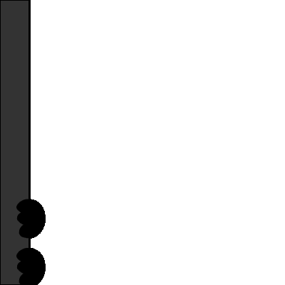

<h2 align="center">Hola!:wave: I am Shashank.:raising_hand_man:</h2>

:eyes: 
  

 
    

***:point_right: About Me*** 

<h6>&nbsp;&nbsp;:diamond_shape_with_a_dot_inside:&nbsp;&nbsp;I'm an Undergraduate Student at Indian Institute of Information Technology, Sri City.  
&nbsp;&nbsp;:diamond_shape_with_a_dot_inside:&nbsp;&nbsp;I Love Contributing to open source projects.  
&nbsp;&nbsp;:diamond_shape_with_a_dot_inside:&nbsp;&nbsp;I'm currently looking for SDE-1 internships.  
&nbsp;&nbsp;:diamond_shape_with_a_dot_inside:&nbsp;&nbsp;I have done my major projects done so far on ReactJS, Redux, NodeJS, Mern stack.  
&nbsp;&nbsp;:diamond_shape_with_a_dot_inside:&nbsp;&nbsp;Text me, if you want to discuss about any project. </h6>
      
  

***:point_right: Technical Skills***

&nbsp;&nbsp;&nbsp;&nbsp;&nbsp;&nbsp;\
&nbsp;&nbsp;&nbsp; &nbsp;&nbsp;&nbsp; 
  

&nbsp;

 

***:monocle_face: Find Me on***

&nbsp;&nbsp;
&nbsp;&nbsp;
&nbsp;&nbsp;

